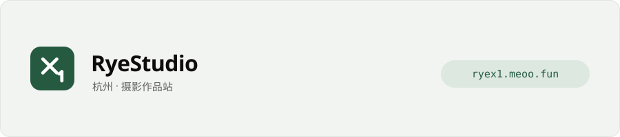

# Rye

**<https://ryex1.meoo.fun/>** —— 杭州 · 摄影。这个站是我自己写的：React + Supabase 的纯前端，没有自建后端。

| 入口 | 里面有什么 |
| --- | --- |
| [作品](https://ryex1.meoo.fun/#/gallery) | 全部照片；可以按分类排，也可以按色调排成一条光谱 |
| [关于](https://ryex1.meoo.fun/#/about) | 设备、联系方式，还有伊布的档案卡 |
| [更新](https://ryex1.meoo.fun/#/changelog) | 每一次改动写了什么 |
| [树洞](https://ryex1.meoo.fun/#/hollow) | 匿名纸团 |

照片详情里可以「带走一张明信片」：挑一张、写一句话，它把城市、日期和伊布邮票排成一张能保存下来的图。

每张照片只透出六项拍摄信息——机身、镜头、ISO、光圈、快门、城市。拍摄时间和坐标不进页面。

## 也写一点工具

- [pokemon-sv-image-prompt](https://github.com/Ryestudio1/pokemon-sv-image-prompt) —— 宝可梦 朱／紫 实机游戏截图风格的图片提示词 skill，附一个组装 + 自检的命令行脚本

## 联系

zongsheng.dong1@gmail.com · 杭州
